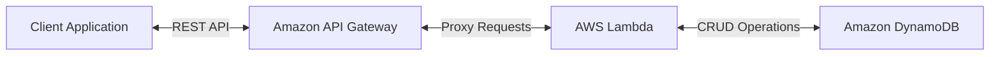
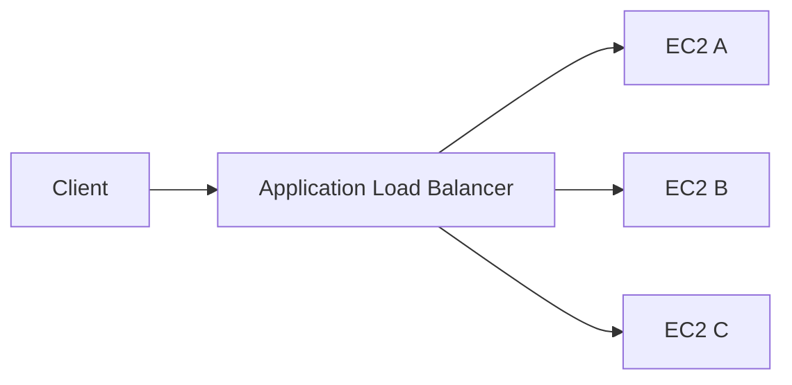
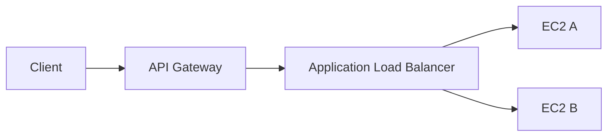

# API Gateway

- Allows us to create REST APIs which are accessible by the clients
- AWS Lambda + API Gateway
  - No infrastructure to manage
- API Gateway provides support for **WebSocket Protocol**
- It handles API versioning (v1, v2, etc.)
- It handles different environment (dev, tets, prod)
- It handles security (authentication and authorization)
- It can create API keys, handles request throttling
- Supports common standards: Swagger / Open API
- It can transform and validate requests and responses
- We can generate SDK and API specifications
- We can cache API responses
- **Any AWS service can be exposed by a API-Gateway**

### Serverless REST API Pattern

- API Gateway exposes REST endpoints.
- API Gateway forwards requests to Lambda.
- Lambda contains the business logic.
- DynamoDB stores application data.
- Common serverless architecture pattern on AWS.

## API Gateway - Integrations

- Lambda Functions
    - It can invoke Lambda functions
    - Easy way to expose REST API backed by AWS Lambda
- HTTP
    - Exposes HTTP endpoints in the back-end. Example: internal HTTP API on premise, Application Load Balancer, etc. By this we can add features like rate limiting, user authentication, API keys to existing back-ends
- AWS Service
    - We can expose any AWS API through API Gateway, examples: API for starting a Step Function workflow, API for posting a message to SQS

## API Gateway vs ALB

| API Gateway | ALB |
|------------|-----|
| API Management | Load Balancing |
| API Keys | Distributes traffic across EC2/ECS |
| Throttling / Quotas | Host & Path Routing |
| Authentication (IAM, Cognito, JWT) | High-throughput HTTP traffic |
| Native Lambda integration | Ideal for multiple servers |

### Rule of Thumb

- Need **API keys, authentication, throttling, or quotas** → **API Gateway**
- Need **traffic distribution across multiple servers or containers** → **ALB**

### Typical Architectures

#### ALB Only (Most Common for EC2)

#### API Gateway + ALB

### Use API Gateway in Front of an ALB When You Need

- API Keys
- Authentication
- Request Throttling
- Usage Plans / Quotas
- Centralized API Management

### AWS Exam Tip

> **Load balancing?** → ALB  
> **API management?** → API Gateway

## Endpoint Types

- Edge-Optimized (default): for global clients
    - Requests are routed through the CloudFormation Edge locations
    - The API Gateway still lives in only one region
- Regional:
    - For clients within the same region
    - Could manually be combined with CloudFront having more control over caching strategies and distributions
- Private:
    - Can only be accessed from a VPC using an ENI
    - We can use resource policies to define access

## Security

### IAM Permissions

- We can give access to an API by creating an IAM policy authorization and attach it to an User/Role
- API Gateway verifies IAM permissions passed by the calling application
- Good practice to provide access within own infrastructure
- It leverages Sig v4 signatures by adding the signature to a header 

### Lambda Authorizer (Custom Authorizer)

- Uses AWS Lambda to validate the token from a header
- Optionally the result of the authentication can be cached
- Helps to use OAuth/SAML/3rd party type of authentication
- The lambda must return an IAM policy for the user

### Cognito User Pools

- Cognito will manage the full user lifecycle
- API gateway verifies identity automatically from AWS Cognito
- No custom implementation is required
- Cognito only helps with authentication, not authorization

### Summary

- IAM:
    - Great for user/roles already within an AWS account
    - Handles authentication + authorization
    - Leverages Sig v4
- Custom Authorizer:
    - Great for 3rd party tokens
    - Very flexible in terms of what IAM policy is returned
    - Handles authentication + authorization
    - We pay per lambda invocation
- Cognito User Pools
    - We manage our own user pool, which can be backed by Facebook, Google login, etc.
    - There is no need to write custom code
    - Authorization in the backend must be implemented
