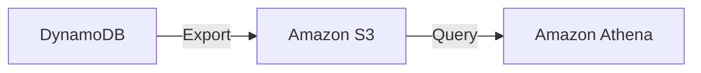
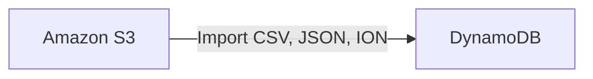

# DynamoDB

- Fully managed, highly available with replication across 3 AZs
- NoSQL database - not a relational database
- Scales to massive workloads, distributed database
- Millions of requests per seconds, trillions or rows, hundreds of thousands of TB of storage
- It is fast and consistent regarding performance (low latency retrieval of data)
- It is integrated with IAM for security, authorization and administration
- It enables event driven programming with DynamoDB Streams
- It provides auto scaling capabilities at low cost

## Basics

- DynamoDB is made of tables
- Each table has a primary key (must be decided at creation time)
- Each table can have an infinite number of items (rows)
- Each item has attributes which can be added over time (can be null)
- Maximum size of an item is 400KB
- Supported data types:
    - Scalar types: string, number binary, null
    - Document types: list, map
    - Set types: string set, number set, binary set

## Provisioned Throughput

- Table must have a provisioned throughput, we must provision read and write capacity units
- Read Capacity Unit (RCU): throughput for reads ($0.00013 per RCU)
    - 1 RCU = 1 strongly consistent read of 4 KB per second
    - 1 RCU = 2 eventually consistent read of 4 KB per second
- Write Capacity Unit (WCU): throughput for writes ($0.00065 per WCU)
    - 1 WCU =  1 write of 1 KB per second
- Option to setup auto-scaling of throughput to meet demand
- Throughput can be exceeded temporarily using burst credits
- If there are no more burst credits, we may get a "ProvisionedThroughputException" in which case it is advised to do exponential back-off retry

## DynamoDB - DAX

- DAX = DynamoDB Accelerator
- Seamless cache for DynamoDB, no application re-write
- Write go through DAX to DynamoDB
- Micro second latency for cached reads and queries 
- Solves the Hot Key problem (too many reads on one value)
- Each cache entry has a 5 minute TTL by default
- We can get up 10 nodes per cluster for cache
- The cache is multi AZ (3 nodes minimum recommended for production)
- It is secure (Encryption at rest with KMC, VPC, IAM, CloudTrail)

## DynamoDB Streams

- Changes in DynamoDB (Create, Update, Delete) can end up in a DynamoDB stream - change log of everything happened in the table
- This stream can be read by AWS Lambda, with which we can do some integrations:
  - React to changes in real time (example: welcome email to new users)
  - Analytics
  - Create derivative tables/views
  - Insert into ElasticSearch
  - Implement cross-region replication
- We can implement cross-region replication using Streams
- Streams have 24 hours of data retention

### Kinesis Data Streams (Newer)

- 1 year of retention
- High number of consumers
- Process using AWS Lambda, Kinesis Data Analytics, Kinesis Data Firehose, AWS Glue Streaming ETL

## DynamoDB - Global Table

- Table replicated across multiple regions
- Two-way replication
- Accessible with low latency
- Apps **READ** and **WRITE** to the table in any region
- Must enable [DynamoDB Streams](#dynamodb-streams) first

## Dynamo - TTL
- Automatically delete files after an expiry timestamp
    - Reduce stored data by keeping only current items
    - Adhere to regulatory obligations
    - Web session handling 

## DynamoDB - New Features

- Transactions
    - All or nothing type of operations
    - We can coordinate insert, update and delete operations across multiple tables [Global Table](#dynamodb-global-table)
    - Include up to 10 unique items or up to 4MB of data per transaction
- On-demand
    - No capacity planning needed (WCU/RCU) - scales automatically
    - It is 2.5x more expensive than provisioned capacity
    - Helpful for spikes and unpredictable loads or if the application has a very low throughput

## DynamoDB – Backups for Disaster Recovery

### Continuous Backups (Point-in-Time Recovery - PITR)

- Continuous backups using **Point-in-Time Recovery (PITR)**
- Optionally enabled for the last **35 days**
- Restore the table to **any point in time** within the backup window
- The recovery process creates a **new table**

### On-Demand Backups

- Full backups for long-term retention until explicitly deleted
- No impact on table performance or latency
- Can be configured and managed through **AWS Backup**
  - Supports **cross-region backup copies**

## DynamoDB – Integration with Amazon S3

### Export to S3

> **Prerequisite:** Point-in-Time Recovery (PITR) must be enabled.

- Export data from DynamoDB directly to Amazon S3
    - Does **not affect the read capacity** of your table
    - Enables data analysis on top of DynamoDB data
    - Useful for retaining snapshots for auditing and compliance

---

### Import from S3

- Import data stored in Amazon S3 into DynamoDB
    - Does **not consume write capacity units (WCUs)**
    - Creates a **new DynamoDB table**
    - Import errors are logged in Amazon CloudWatch Logs

## Security

- We get VPC endpoints to access DynamoDB without internet
- IAM policies
- Encryption at rest using AWS KMS
- Encryption at transit is handled by SSL/TLS
- Backup and restore
    - DynamoDB provides point in time restores  (just like any RDS)
    - Backup does not have any performance impact on the tables
- Global tables
    - Multi region, fully replicated, high performance
    - Dynamo provides active-active replication
    - In order to be able to replicate data, DynamoDB Streams should be enabled

## Migration

- We can use DMS to migrate data to DynamoDB (from Mongo, Oracle, MySQL, st3, etc.)
